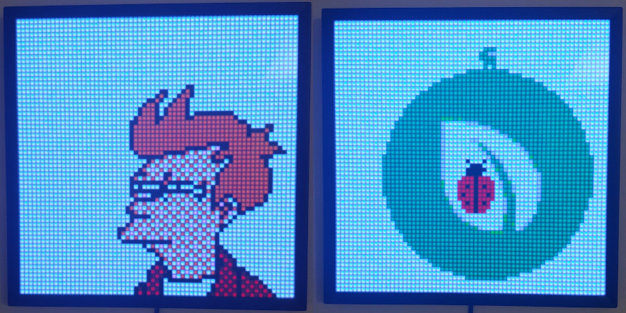
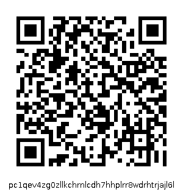

# Immutable.place on the Pixoo 64



This nodejs software displays pixel art from
[immutable.place](https://immutable.place/) on the Divoom Pixoo 64 art
display.

[Immutable.place](https://immutable.place/) is a collaborative pixel art project
on the Peercoin blockchain. Anyone can produce artworks on a 1000x1000 pixel
canvas by spending coins to burn addresses. This project was originally inspired
by [milliondollarhomepage.com](http://milliondollarhomepage.com) and
[r/place](https://www.reddit.com/r/place/).

This software will automatically cycle through artworks on the canvas. Areas are
shown according to frequency of updates and a calculation of entropy.

## Usage

You need to have `npm` available on your system. You can install the package
globally alongside `typescript` and `ts-node`, ensuring that you are within the
repository directory:

```
npm i -g typescript ts-node
npm i -g
```

This will make the `immutable-place-pixoo` command available. Find the IP
address of your Pixoo 64 on the local network which can be found in the Divoom
app. You can start displaying artworks with the following command, replacing
`IP` with the correct IP address:

```
immutable-place-pixoo "http://IP"
```

Available options can be displayed using `immutable-place-pixoo --help`.

You may also run the software locally by replacing the command with `npm start
--`.

## Donation

If you enjoy this software, you may donate Peercoin to the following address.
Any donations are highly appreciated.

`pc1qev4zg0zllkchrnlcdh7hhplrr8wdrhtrjajl6l`



